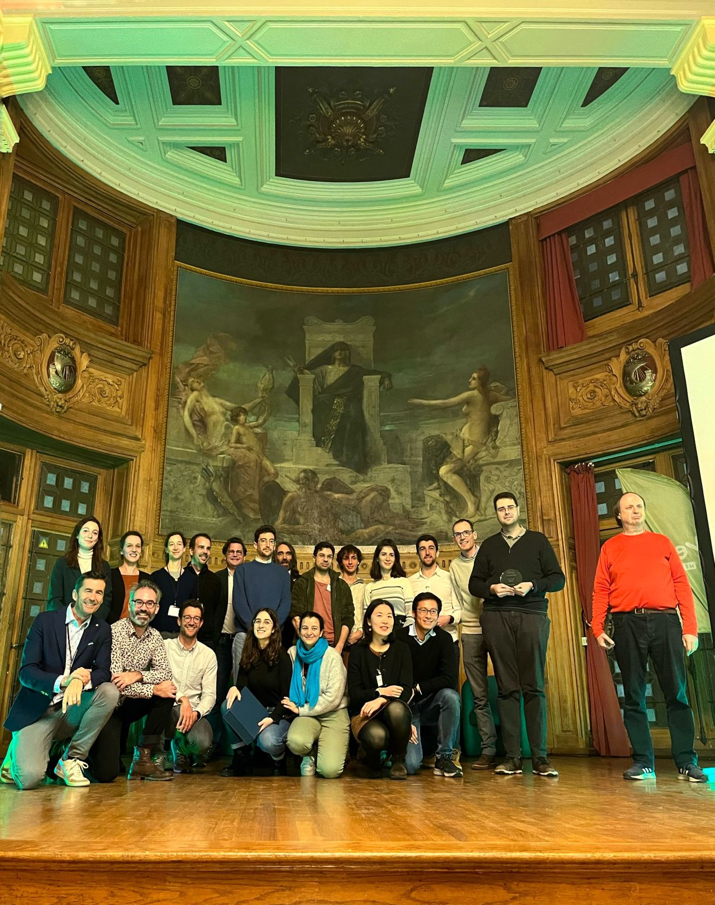
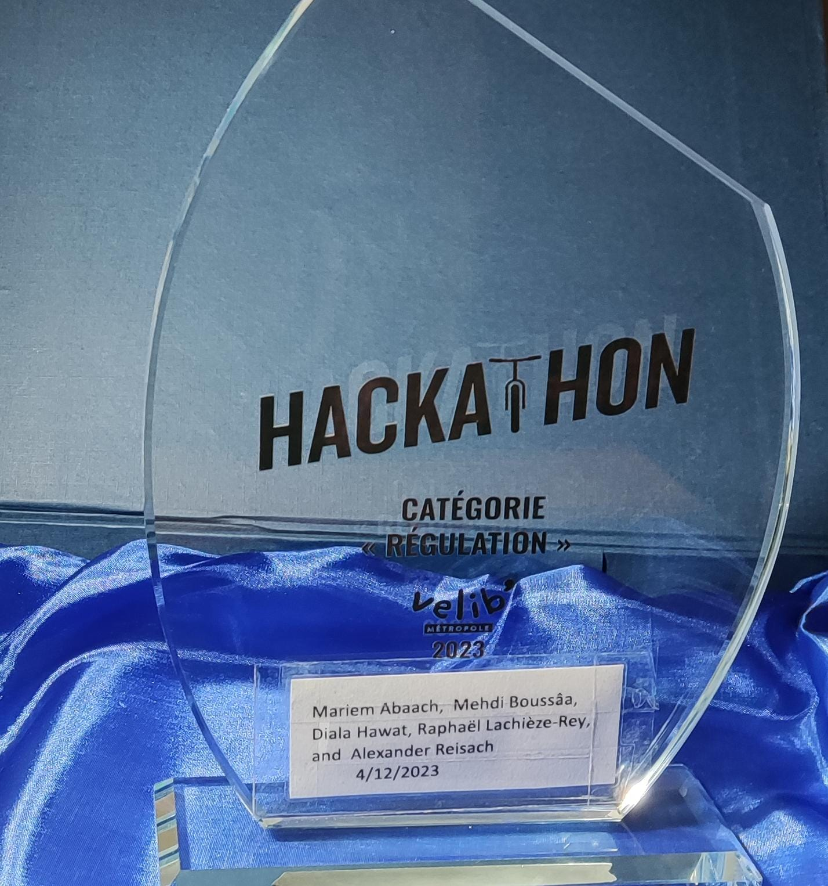

 <h1>About</h1> 

* I currently work as a Postdoctoral Researcher at the [LPSM](https://www.lpsm.paris/) laboratory at [Sorbonne Université](https://www.sorbonne-universite.fr/) in Paris, France, collaborating with [Charlotte Dion-Blanc](https://sites.google.com/site/charlottedionblanc/), [Stéphane Robin](https://www.pantheonsorbonne.fr/page-perso/strobin), and [Emilie Lebarbier](https://www.parisnanterre.fr/mme-emilie-lebarbier). My focus is on change-point detection for the Hawkes process.
* Previously, I pursued my Ph.D. at the [CRIStAL](https://www.cristal.univ-lille.fr/) laboratory within the [SigMA](https://www.cristal.univ-lille.fr/?rubrique27&eid=30) team in Lille, France, and also at the [MAP5](https://map5.mi.parisdescartes.fr/) laboratory in the probability team in Paris, France. I successfully defended my thesis intitled  titled ["Point Processes for Numerical Integration"](https://www.theses.fr/s331068) on the 27th of November 2023.
* In December 2023, my team secured first place in the “regulation” category at the [hackathon Vélib' métropole](https://blog.velib-metropole.fr/hackathon/) in Paris, France, focusing on improving the regulation of bikes at Vélib's stations.
* Furthermore, in 2021, my team achieved victory in the [challenge mathématiques et entreprise](https://challenge-maths.sciencesconf.org/) organized by [AMIES](https://www.agence-maths-entreprises.fr/public/pages/index.html). Our work revolved around enhancing data quality for [Foyer](https://www.foyer.lu/en/homepage), located in Leudelange, Luxembourg.
* Additionally, I received the [PGSM](https://applications.sciencesmaths-paris.fr/fr/les-laureats-du-programme-pgsm-master-850.htm#:~:text=France-,HAWAT,-Diala) excellence scholarship in 2019 for a Master 2 grant at Université Paris Cité, Paris, France.

------------------------------

 <h1>News </h1> 

------------------------------

* # Project (Dec 2023): [Hackathon Vélib' métropole](https://blog.velib-metropole.fr/hackathon/)
   
  With Mariem Abaach, Mehdi Boussâa, [Raphaël Lachièze-Rey](https://helios2.mi.parisdescartes.fr/~rlachiez/), [Alexander Reisach](https://scriddie.github.io/), and myself, our project won the [Hackathon Vélib' métropole](https://blog.velib-metropole.fr/hackathon/) in the “regulation” category.
  Our project focuses on improving the nightly regulation conducted by Smovengo, addressing imbalances in the fill levels of bike stations caused by users' rides during the day. 
  Following a data analysis, we identify a potential approach and mathematically reformulate the problem. 
  We propose employing mathematical tools such as optimal transport and neural networks to numerically solve the issue.
  We aim to contribute towards the mitigation of this issue within this service we hold dear, and we are optimistic that pushing our project further may play a role in alleviating these challenges.

  

  
  
  
 
  <!-- For more details, check the [Projects](Projects) section. -->

* # Ph.D. defense (Nov 2023): 
  I successfully defended my thesis intitled  titled ["Point Processes for Numerical Integration"](https://www.theses.fr/s331068) on the 27th of November 2023.

* # Blogpost (Nov 2023): 

    **`Coulomb rhymes with variance reduction… Well, it does rhyme if you read the title aloud with a French accent, hon hon hon.''**

    This marks the opening of a blog post authored by [Rémi Bardenet](https://rbardenet.github.io/).
    In the blog post, Rémi provides an engaging pedagogical summary of the main concept discussed in our recent preprint entitled ['Repelled Point Processes with Application to Numerical Integration'](https://arxiv.org/abs/2308.04825), which was co-authored by my Ph.D. supervisors, [Raphaêl Lachièze-Rey](https://helios2.mi.parisdescartes.fr/~rlachiez/) and [Rémi Bardenet](https://rbardenet.github.io/), along with myself.
    The complete blog post is available at [link] (<https://statisfaction-blog.github.io/posts/01-11-2023-repelled-point-processes/repelled_point_processes.html>).

    Enjoy the read!

* # Preprint 2023: 

    [Repelled point processes with application to numerical integration](https://arxiv.org/abs/2308.04825)

* # Python Package 2023:

    **[MCRPPy](https://github.com/dhawat/MCRPPy)** :

    
    
    

    An open-source Python package that currently includes:

      * Methods for sampling from a variety of point processes, including the homogeneous Poisson, Thomas, Ginibre, scrambled Sobol, Binomial, and their Repelled counterparts.
      * Several Monte Carlo methods, including a Monte Carlo method with the Repelled point process.
      * Tools for visualizing the gravitational allocation from the Lebesgue measure to a point process within a two-dimensional space (d=2).

    We provide three tutorial Jupyter Notebooks.

      * Tutorial for sampling a Repelled point process.
      * Tutorial for estimating function integrals using the available Monte Carlo methods.
      * Tutorial for illustrating a two-dimensional gravitational allocation from Lebesgue to a point process.

    We also provide two Jupyter Notebooks for replicating the study of the companion paper
    [''Repelled point processes with application to numerical integration''](https://arxiv.org/abs/2308.04825).

    **Any feedback is most welcome!**

  
  
Figure: A sample from a Poisson point process (left) and the corresponding repelled point process (right). The force field driving the repulsion is represented in the middle.

<!-- ----------------------------

  

  

  

   

 -->
